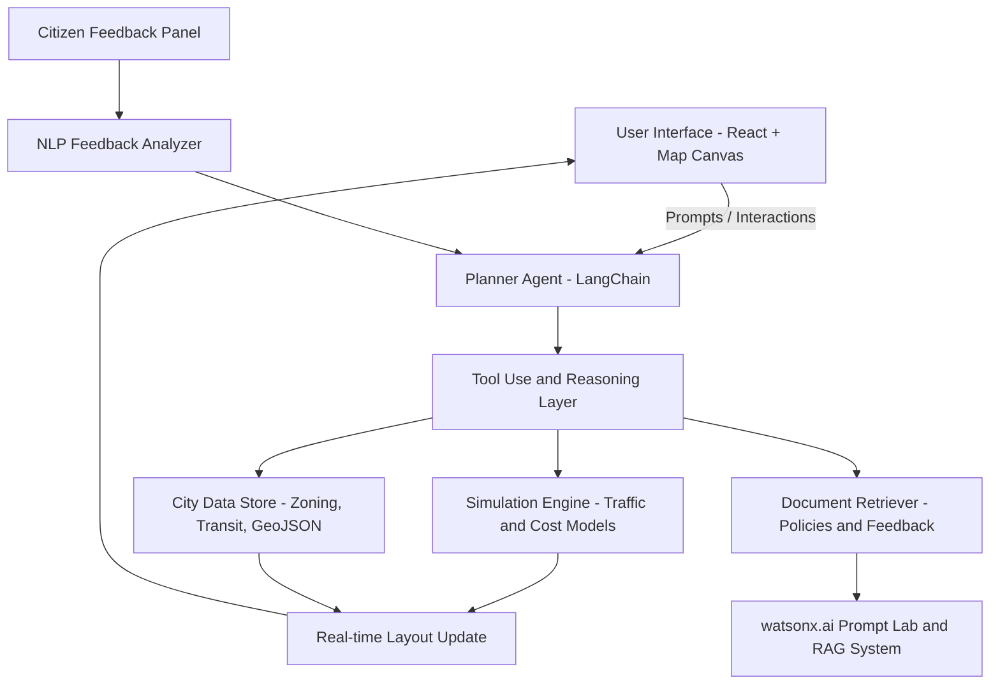
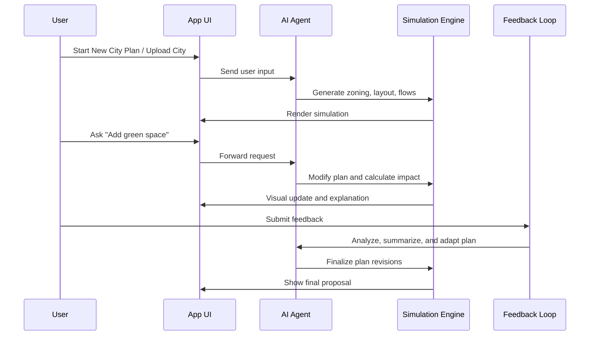

# Project Plan — Agentic City Planner

## 🎯 Goal

Design and build an AI-powered agentic system that allows users to:

1. **Create a city plan** from scratch or build upon an existing city's layout.
2. Use an intelligent, decision-making **AI planner agent** to simulate, recommend, and modify urban components.
3. **Visually render** changes in an interactive UI.
4. Incorporate **public feedback** as a final phase and intelligently revise the plan accordingly.

---

## 🧩 Core Functional Stages

### 1. City Initialization

* **Option A:** Start from a blank map (raw land planning).
* **Option B:** Import current city data or blueprint (GIS, layout JSON, architectural plans, etc).
* User defines constraints: population, area, goals (green zones, transit, housing, etc).

### 2. Agentic Planning Layer

* AI Agent generates the base city plan:

  * Zoning areas (residential, commercial, green, industrial).
  * Core infrastructure (roads, water, sewage, power).
  * Public services (schools, hospitals, stations).
  * Simulation of flows: traffic, population density, pollution.
* UI displays this evolving layout in a **real-time simulation canvas**.

### 3. Interactive Design Space (UI)

* User can ask: “Add green space here” or “Why is traffic high in zone D?”
* AI Agent responds with insight and changes layout dynamically.
* All actions have reasoning + visual impact.

### 4. Feedback Phase

* Deploy interactive proposal to simulated **citizen feedback panel**.
* Citizens give comments/ratings on livability, walkability, fairness.
* Feedback categorized (sentiment + topic classification).
* AI reflects feedback and suggests adaptations: e.g., "Add more affordable housing in Zone B".

---

## 🔧 Tech Stack (Proposal)

* **AI + Agentic Layer:** IBM watsonx.ai with LangChain / LangGraph.
* **Data Ingestion:** GIS, JSON layouts, public datasets.
* **UI/UX:** React + Canvas/Map engine (MapLibre / Leaflet / Three.js).
* **Simulation:** Simple backend simulation engine (traffic, flow, costs).
* **Feedback Ingestion:** NLP classification + integration with RAG.

---

## ✅ Deliverables for Demo

* End-to-end working prototype with:

  * City layout creation from scratch, uploaded JSON, or imported blueprint.
  * Real-time AI decision-making in UI.
  * At least 3 AI-driven modifications with rationale.
  * Feedback panel input and reflected design change.

---

## 🧠 Team Notes

Use this as the foundational vision document. We can split this into tasks and technical architecture in the next step.

---

## 🏗️ Application Architecture (High-Level)

### 🔍 Component Descriptions

**1. User Interface - React + Map Canvas**
Interactive frontend where users can:

* Create or upload city plans (blueprints, JSON).
* View real-time layouts and simulations.
* Send natural language prompts to the AI.
* Interact with design changes, overlays, and data layers.

**2. Planner Agent - LangChain**
The brain of the system. It:

* Interprets user goals and prompts.
* Decides what tools to invoke.
* Orchestrates reasoning steps.
* Maintains context across interactions.

**3. Tool Use and Reasoning Layer**
Executes the decisions made by the agent. Includes:

* Blueprint processors.
* Zoning logic evaluators.
* Optimization modules (e.g., cost minimizer, green-space maximizer).

**4. Simulation Engine - Traffic and Cost Models**
Backend models to:

* Calculate traffic flow and congestion.
* Estimate cost of infrastructure proposals.
* Simulate population density and utility reach.

**5. City Data Store - Zoning, Transit, GeoJSON**
Stores:

* Base map data, zoning files, and street layouts.
* Uploaded city blueprints or GeoJSONs.
* Temporary or final plan versions.

**6. Document Retriever - Policies and Feedback**
Connects to:

* Planning policies (PDFs, docs).
* Historic plans and community reports.
* Uploaded feedback.

**7. watsonx.ai Prompt Lab and RAG System**
Supports:

* Document-based question answering.
* Retrieval-augmented generation from public documents.
* Embedding + semantic reasoning.

**8. Real-time Layout Update**
Merges simulation and data into a UI-compatible format to:

* Update maps.
* Animate changes.
* Reflect agentic decisions visually.

**9. Citizen Feedback Panel + NLP Feedback Analyzer**
Captures user and citizen feedback:

* Classifies sentiment and topic.
* Passes suggestions to Planner Agent for revisions.
* Enables participatory design with traceability.

---

## 🔁 Flow Diagram: User Journey

---

## 📝 TODOs

### 🔹 Setup & Initialization

* [ ] Create blueprint & JSON upload handler in UI
* [ ] Integrate IBM watsonx.ai with API keys for LangChain agent
* [ ] Set up GIS/GeoJSON ingestion and map rendering engine (MapLibre/Leaflet)

### 🔹 Agent Development

* [ ] Implement Planner Agent using LangChain
* [ ] Connect blueprint processor & zoning evaluator tools
* [ ] Integrate RAG with watsonx.ai for document reasoning

### 🔹 Simulation Layer

* [ ] Build backend simulation engine (traffic, utility, cost models)
* [ ] Define zoning logic and infrastructure templates

### 🔹 Feedback & Adaptation

* [ ] Build feedback panel UI and form handler
* [ ] Implement NLP classifier for feedback themes and sentiment
* [ ] Enable adaptive planning flow based on citizen input

### 🔹 Final UI & Demo Flow

* [ ] Enable real-time layout updates with visual overlays
* [ ] Test 3+ AI-driven scenario modifications with rationale
* [ ] Package plan summary view or export module

### 🔹 Stretch Goals

* [ ] Multi-agent planner collaboration
* [ ] Voice-command integration
* [ ] PDF generation of Reports

---

# Ideas

- web search as a tool call for verification of constraints and resources being optimized.
- also recheck the resources & constraints and tool call again to fix it go back nd forth on it.