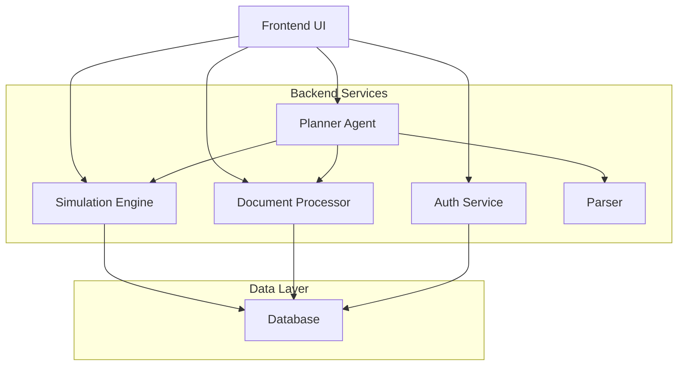
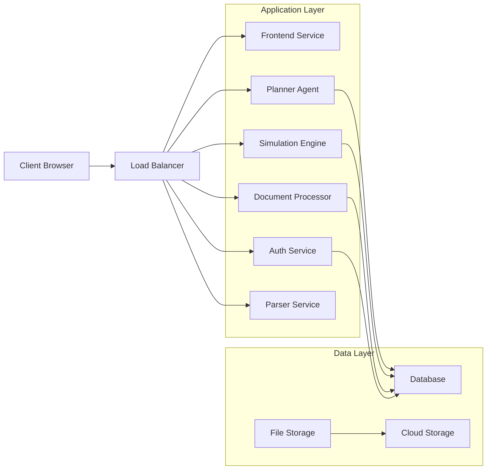

# Agentic City Planner - System Architecture

## Overview

The Agentic City Planner is a comprehensive urban planning tool that combines AI-powered decision making with simulation capabilities and citizen feedback mechanisms.

## Component Architecture

## Component Descriptions

### 1. Frontend UI (Missing)
Interactive web interface for:
- City planning visualization
- Map rendering with overlays
- User interaction with AI agent
- Simulation result display
- Document upload and feedback submission

### 2. Auth Service (Node.js/Express)
Handles:
- User authentication and authorization
- Session management
- API gateway for all services

### 3. Planner Agent (Python/FastAPI)
The central AI brain that:
- Processes user requests
- Orchestrates external tools
- Generates rationale for decisions
- Maintains conversation context

### 4. Simulation Engine (Python/FastAPI)
Computes quantitative outcomes:
- Traffic flow simulations
- Cost estimations
- Pollution impact analysis
- Real-time layout updates

### 5. Document Processor (Python/FastAPI)
Handles:
- Document upload and storage
- RAG-based policy queries
- Feedback analysis and classification

### 6. Parser (Python)
Processes:
- Blueprint file parsing (GeoJSON, DXF, JSON, ZIP)
- Image-based feature detection
- Normalization of city data

## Data Flow

1. **User Interaction**: User interacts with frontend UI
2. **Authentication**: Auth service validates user credentials
3. **Planning Request**: User request sent to Planner Agent
4. **Tool Orchestration**: Planner Agent determines required tools
5. **Simulation**: Simulation Engine runs relevant models
6. **Document Processing**: Document Processor handles policy queries
7. **Parsing**: Parser processes uploaded blueprints
8. **Feedback**: Citizen feedback analyzed and incorporated
9. **Visualization**: Results displayed in frontend UI

## Integration Points

### Planner Agent Integrations:
- **Simulation Engine**: For traffic/cost/pollution simulations
- **Document Processor**: For policy document retrieval
- **Parser**: For blueprint processing
- **Frontend**: For user interaction

### API Endpoints:
- Auth Service: `/api/auth/*`, `/api/init-city`, `/api/prompt`
- Planner Agent: `/plan`, `/register-tool`
- Simulation Engine: `/simulate/*`, `/models/*`
- Document Processor: `/documents/*`, `/query`, `/feedback/*`

## Deployment Architecture

## Priority Implementation Order

1. **Frontend UI** - Critical for user interaction
2. **Backend Integrations** - Connect all services
3. **Database Implementation** - Persistent storage
4. **Security & Authentication** - Secure all services
5. **Deployment & Monitoring** - Production readiness