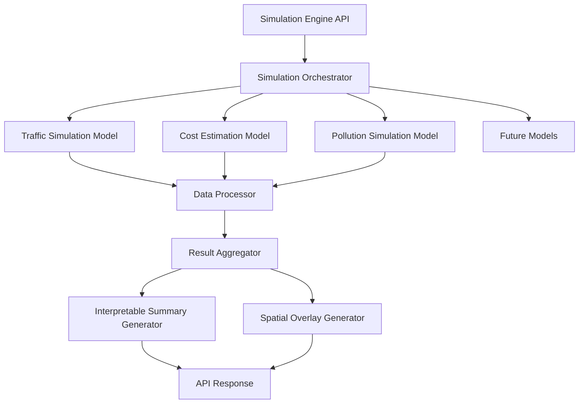

# Simulation Engine Plan - IBM Watsonx Hackathon

## Overview
The Simulation Engine is a critical component of the Agentic City Planner system, owned by Dev B. It computes quantitative outcomes for urban planning changes, including traffic flow, cost estimation, and pollution impact. The engine provides interpretable summaries and spatial overlays through secure REST endpoints.

## Requirements Analysis
Based on the Tasks.md document, the Simulation Engine must:
- Compute quantitative outcomes for changes (traffic, cost, pollution)
- Have a modular architecture to plug in future models (e.g. walkability)
- Return interpretable summaries and spatial overlays
- Expose secure REST endpoints for triggering simulations

**Input:** Zoning plan, infra edits, traffic flow inputs, tool outputs
**Output:** Simulated KPIs (cost, traffic), update diffs for map

## Integration with Planner Agent
The Simulation Engine integrates with the Planner Agent (Dev A) through:
1. REST API endpoints that the Planner Agent can invoke
2. Tool registration mechanism where the Simulation Engine registers itself with the Planner Agent
3. Standardized data schemas for input/output communication

The Planner Agent's `register-tool` endpoint allows the Simulation Engine to register its services, and the `/plan` endpoint in the Planner Agent can trigger simulation requests.

## REST API Endpoints

### Main Simulation Endpoints
- `POST /simulate` - Run comprehensive simulation for a city plan
- `POST /simulate/traffic` - Run traffic flow simulation
- `POST /simulate/cost` - Run cost estimation simulation
- `POST /simulate/pollution` - Run pollution impact simulation
- `GET /health` - Health check endpoint

### Utility Endpoints
- `GET /models` - List available simulation models
- `POST /models/register` - Register new simulation model (for extensibility)
- `GET /simulation/{id}` - Get results of a specific simulation

## Modular Architecture Design



### Core Components
1. **Simulation Orchestrator** - Coordinates execution of different simulation models
2. **Traffic Simulation Model** - Computes traffic flow and congestion metrics
3. **Cost Estimation Model** - Calculates infrastructure and operational costs
4. **Pollution Simulation Model** - Estimates environmental impact
5. **Data Processor** - Normalizes input data for simulation models
6. **Result Aggregator** - Combines results from different models
7. **Interpretable Summary Generator** - Creates human-readable summaries
8. **Spatial Overlay Generator** - Produces map overlays for visualization

## Model Implementation Plans

### Traffic Simulation Model
- **Purpose**: Calculate traffic flow, congestion levels, and travel times
- **Methodology**: 
  - Graph-based road network analysis
  - Agent-based simulation for traffic flow
  - Congestion modeling based on road capacity and usage
- **Key Metrics**: Average travel time, congestion index, traffic volume
- **Inputs**: Road network data, zoning information, population density
- **Outputs**: Traffic flow maps, congestion heatmaps, travel time estimates

### Cost Estimation Model
- **Purpose**: Estimate financial costs of proposed changes
- **Methodology**:
  - Infrastructure cost calculation (roads, utilities, buildings)
  - Operational cost estimation (maintenance, services)
  - Economic impact analysis
- **Key Metrics**: Total project cost, annual operational cost, ROI projections
- **Inputs**: Zoning plan, infrastructure requirements, material costs
- **Outputs**: Cost breakdown, budget recommendations, financial impact summary

### Pollution Simulation Model
- **Purpose**: Estimate environmental impact of proposed changes
- **Methodology**:
  - Emission modeling from traffic and industry
  - Air quality dispersion modeling
  - Green space impact assessment
- **Key Metrics**: Air quality index, CO2 emissions, pollution hotspots
- **Inputs**: Traffic data, industrial zones, green space distribution
- **Outputs**: Pollution maps, environmental impact score, mitigation recommendations

## Interpretable Summaries and Spatial Overlays

### Summary Generation
- **Format**: Natural language explanations of simulation results
- **Content**: Key findings, impact assessment, recommendations
- **Audience**: City planners, stakeholders, public officials

### Spatial Overlays
- **Traffic Overlay**: Color-coded congestion map with flow directions
- **Cost Overlay**: Heatmap of infrastructure investment needs
- **Pollution Overlay**: Air quality visualization with hotspots
- **Combined Overlay**: Integrated view of all simulation results

## Security Implementation
- **Authentication**: JWT token validation for API access
- **Authorization**: Role-based access control for different simulation features
- **Data Protection**: Encryption of sensitive data in transit and at rest
- **Rate Limiting**: API rate limiting to prevent abuse
- **Input Validation**: Strict validation of all input parameters

## Data Schemas

### Simulation Input Schema
```json
{
  "zoning_plan": {
    "zones": [
      {
        "id": "string",
        "type": "residential|commercial|industrial|green_space",
        "area": "float",
        "location": {"x": "float", "y": "float"},
        "properties": {}
      }
    ]
  },
  "infra_edits": [
    {
      "type": "road|utility|building",
      "action": "add|modify|remove",
      "specifications": {}
    }
  ],
  "traffic_inputs": {
    "population_density": "float",
    "peak_hours": ["08:00", "17:00"],
    "vehicle_ownership": "float"
  },
  "simulation_options": {
    "models": ["traffic", "cost", "pollution"],
    "time_horizon": "5 years",
    "scenarios": ["optimistic", "pessimistic"]
  }
}
```

### Simulation Output Schema
```json
{
  "simulation_id": "string",
  "timestamp": "ISO8601",
  "inputs_ref": "input_id",
  "results": {
    "traffic": {
      "metrics": {
        "avg_travel_time": "float",
        "congestion_index": "float",
        "total_volume": "float"
      },
      "spatial_overlay": "base64_encoded_overlay_data"
    },
    "cost": {
      "metrics": {
        "total_cost": "float",
        "annual_operational": "float",
        "cost_per_capita": "float"
      },
      "breakdown": {
        "infrastructure": "float",
        "services": "float",
        "maintenance": "float"
      }
    },
    "pollution": {
      "metrics": {
        "air_quality_index": "float",
        "co2_emissions": "float",
        "pollution_hotspots": "int"
      },
      "recommendations": ["string"]
    }
  },
  "summary": {
    "executive_summary": "string",
    "key_findings": ["string"],
    "recommendations": ["string"]
  },
  "update_diffs": {
    "map_updates": ["change_object"],
    "layer_updates": ["layer_object"]
  }
}
```

## Implementation Roadmap

### Phase 1: Core Framework (Days 1-2)
- Set up project structure and dependencies
- Implement basic REST API framework
- Create data models and schemas
- Implement health check and basic endpoints

### Phase 2: Simulation Models (Days 3-5)
- Implement traffic simulation model
- Implement cost estimation model
- Implement pollution simulation model
- Create data processing pipeline

### Phase 3: Integration & Visualization (Days 6-7)
- Integrate with Planner Agent tool registration
- Implement result aggregation
- Create interpretable summary generation
- Generate spatial overlays for visualization

### Phase 4: Security & Testing (Days 8-9)
- Implement authentication and authorization
- Add input validation and error handling
- Create comprehensive test suite
- Performance optimization

### Phase 5: Documentation & Demo (Day 10)
- Create API documentation
- Prepare demo scenarios
- Write user guides
- Final testing and bug fixes

## Testing Strategy

### Unit Tests
- Test individual simulation models with mock data
- Validate data processing functions
- Test summary generation algorithms
- Verify spatial overlay creation

### Integration Tests
- Test API endpoints with valid and invalid inputs
- Verify integration with Planner Agent
- Test data flow between components
- Validate security measures

### Performance Tests
- Load testing for concurrent simulation requests
- Response time measurement for different simulation complexities
- Memory usage analysis
- Scalability assessment

### Demo Scenarios
1. **Basic Zoning Change**: Add residential zone and simulate impact
2. **Infrastructure Addition**: Add new road and analyze traffic improvement
3. **Comprehensive Plan**: Multi-zone development with full simulation
4. **Edge Cases**: Invalid inputs, error conditions, boundary scenarios

## Technology Stack
- **Language**: Python (for consistency with Planner Agent)
- **Framework**: FastAPI (for REST API implementation)
- **Data Processing**: Pandas, NumPy
- **Visualization**: Matplotlib, Folium (for spatial overlays)
- **Testing**: Pytest, unittest
- **Deployment**: Docker containerization
- **Documentation**: Swagger/OpenAPI

## Future Extensibility
The modular architecture allows for easy addition of new simulation models:

1. **Walkability Model**: Pedestrian flow and accessibility analysis
2. **Energy Model**: Power grid impact and renewable energy integration
3. **Water Model**: Water usage and drainage system analysis
4. **Economic Model**: Local economy and employment impact assessment

Each new model would implement a standard interface and register with the Simulation Orchestrator.
